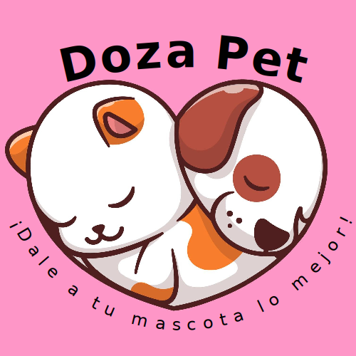

<p align="center">
  
</p>

Application to interact with the server (pet food dispenser) and defining the user's pet information for its respective analysis.

## Development

### Requirements:

- [`flutter`](https://docs.flutter.dev/get-started/install)

### Knowledges:

#### Architecture pattern

We define MVC-like architecture, mainly differentiating the folders [models](/lib/models/), [controllers](/lib/controllers/), [repositories](/lib/repositories/), and [screens](/lib/screens/)

To learn how to develop following the above, see [Implementing a repository pattern in Flutter](https://blog.logrocket.com/implementing-repository-pattern-flutter/))

#### Widgetbook

We use it to have better control of the designed components.

```bash
flutter run -d $target -t widgetbook/main.dart
```

See: [Widgetbook Docs](https://docs.widgetbook.io/)

#### Localizations

Available in [l10n folder](/assets/l10n/), currently two are supported: [en](/assets/l10n/app_en.arb) and [es](/assets/l10n/app_es.arb).

To apply any changes to these, you must generate the files:

```bash
flutter gen-l10n
```

See: [Internationalizing Flutter apps](https://docs.flutter.dev/development/accessibility-and-localization/internationalization)
